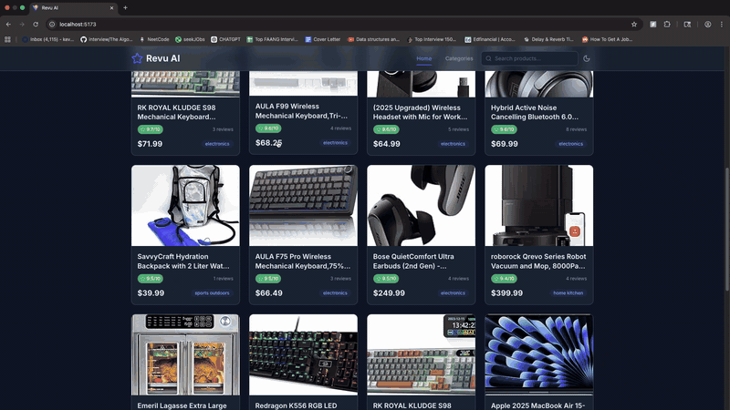

# Revu AI

**AI-powered product review aggregator that ranks products by sentiment analysis across e-commerce platforms.**

[Live Demo](https://revu-ai-five.vercel.app/) | [Try it out](https://revu-ai-five.vercel.app/)

<p align="center">
  
</p>

---

## What It Does

Revu AI helps users make smarter purchasing decisions by aggregating product reviews from Amazon and analyzing them with AI. Instead of reading hundreds of reviews, users get:

- **AI-generated ratings (0-10)** based on sentiment analysis of real customer reviews
- **Pros & cons extraction** automatically pulled from review text
- **An AI chat assistant** on every product page to answer follow-up questions grounded in review data
- **800+ products** across 8 categories, searchable and sortable

## How It Works

```
Amazon (SerpApi) --> Review Fetching --> Claude AI Sentiment Analysis --> Rating (0-10)
                                                  |
                                           Pros/Cons Extraction
```

1. Products are synced from Amazon via [SerpApi](https://serpapi.com/)
2. Reviews are fetched on-demand when a user visits a product, or in scheduled monthly batches
3. [Claude AI](https://www.anthropic.com/claude) analyzes each review for sentiment (0-1 scale) and extracts pros/cons
4. Product ratings are computed as the average sentiment score across all reviews, scaled to 0-10
5. An AI chatbot on each product page answers questions using the product's reviews as context

## Tech Stack

### Frontend
- **React 19** with TypeScript (strict mode)
- **Vite 7** for builds
- **TanStack Query 5** for server state management and caching
- **Tailwind CSS** with custom design system (dark mode, rating color scale)
- **Framer Motion** for page transitions and animations
- **React Router 7** for client-side routing

### Backend
- **Python Flask** with Blueprints for modular route organization
- **SQLAlchemy** ORM with SQLite (dev) / PostgreSQL (production)
- **Pydantic** for response validation
- **Anthropic Claude API** for sentiment analysis and product chat (SSE streaming)
- **SerpApi** for Amazon product search and review fetching

### Infrastructure
- **Vercel** (frontend hosting)
- **Render** (backend API + PostgreSQL + cron jobs)
- **Automated monthly review sync** via Render cron with configurable batch size

## Architecture

```
frontend/                          backend/
  src/                               routes/
    components/                        products.py      # Product CRUD + on-demand review fetch
      products/   (cards, grid,        categories.py    # Category browsing + search
                   detail, rating)     health.py        # Health check + API usage stats
      reviews/    (cards, pros/cons)
      chat/       (AI chat widget)   services/
      ui/         (design system)      serpapi_client.py   # Amazon search + reviews (rate limited)
      layout/     (header, footer)     review_service.py   # Fetch orchestration + caching
    hooks/        (React Query)        sentiment_service.py # Claude AI analysis (batched)
    pages/        (Home, Detail,       chat_service.py     # Product chat context builder
                   Categories,
                   Search, 404)      models/
    config/       (Axios client)       product.py, review.py, category.py, api_usage.py
    types/        (TypeScript types)
                                     sync.py            # CLI: product sync + batch review fetch
```

## Key Technical Decisions

| Decision | Rationale |
|----------|-----------|
| On-demand + batch review fetching | Balances API budget (250 SerpApi calls/month) with data freshness. Users get instant results for products they visit; cron fills in the rest monthly. |
| Claude tool_use for sentiment | Structured output via tool calling ensures consistent JSON responses with sentiment scores clamped to [0, 1] and pros/cons arrays. |
| SSE streaming for chat | Server-Sent Events deliver real-time AI responses without WebSocket overhead. Flask's `stream_with_context` handles backpressure. |
| Nullable ratings with N/A display | Products without AI-analyzed reviews show "N/A" rather than misleading default scores. Sorted last to prioritize data-backed rankings. |
| 7-day review cache | Prevents redundant API calls while keeping reviews reasonably fresh. Configurable via `REVIEW_CACHE_DAYS` env var. |

## Getting Started

### Prerequisites

- Python 3.11+
- Node.js 18+
- [SerpApi key](https://serpapi.com/) (free tier: 250 searches/month)
- [Anthropic API key](https://console.anthropic.com/) (for AI sentiment analysis + chat)

### Backend

```bash
cd backend
python -m venv venv
source venv/bin/activate
cp .env.example .env          # Add your API keys
pip install -r requirements.txt
python app.py                  # Runs on http://localhost:5001
```

### Frontend

```bash
cd frontend
npm install
npm run dev                    # Runs on http://localhost:5173
```

### Populating Data

```bash
cd backend
source venv/bin/activate

# Sync products from Amazon (~56 SerpApi calls)
python sync.py

# Fetch reviews + AI ratings for unrated products
python sync.py --fetch-reviews --batch 200

# Seed mock data instead (no API keys needed)
python -c "from seed_data.mock_products import seed_database; from app import app; seed_database(app)"
```

## API Endpoints

| Endpoint | Description |
|----------|-------------|
| `GET /api/products` | Paginated product list with search, category filter, and sorting |
| `GET /api/products/:id` | Product detail with reviews (triggers on-demand review fetch) |
| `POST /api/products/:id/chat` | AI chat grounded in product reviews (SSE streaming) |
| `GET /api/categories` | All categories |
| `GET /api/categories/:slug/products` | Products in a category |
| `GET /api/categories/search?q=` | Search categories by name |
| `GET /api/health` | Health check |
| `GET /api/api-usage` | SerpApi monthly usage stats |

## License

MIT
